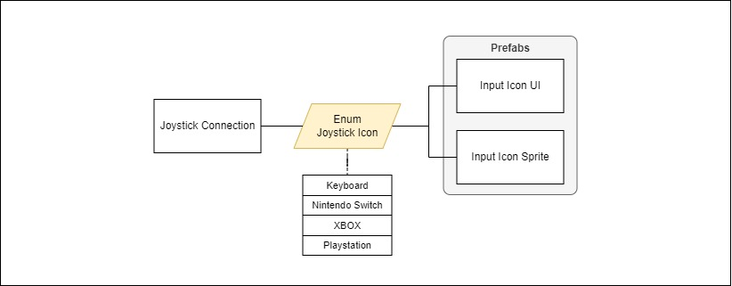
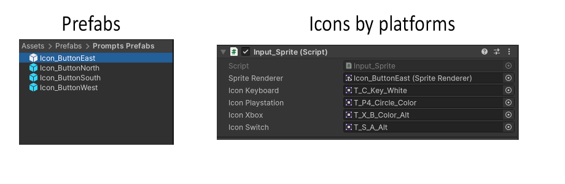
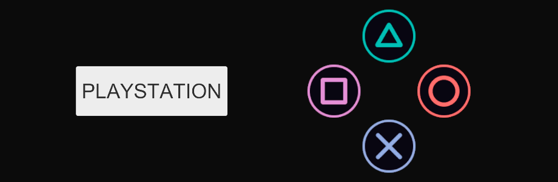
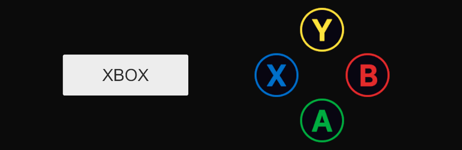
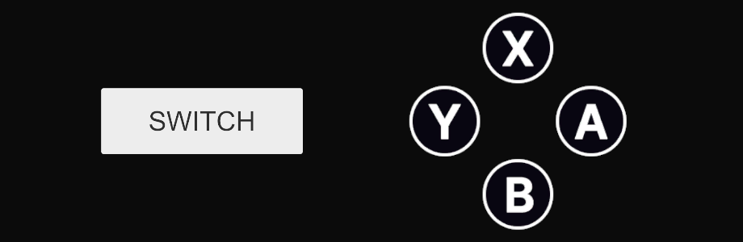
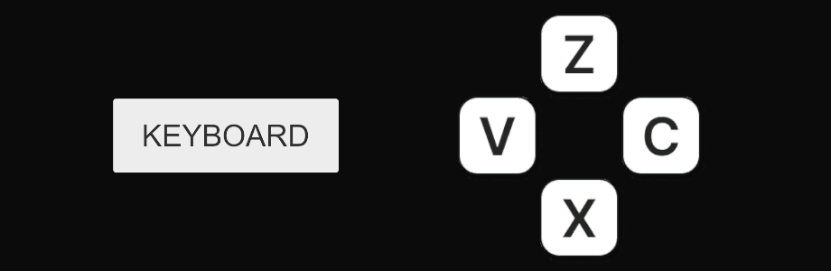

# Unity Joystick Icon
   

# Example of Use
1. Add the `Input_Sprite` class or the `Input_UI` class to an empty Gameobject.
2. Add the prompts for each platform
3. Play Scene

   

 # Results (Gameplay)
### Playstation
   

### Xbox
   

### Switch
   

### Keyboard
   
